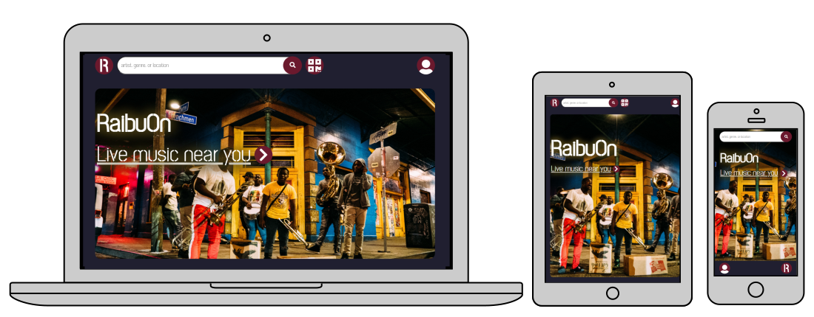

<h1>Raibuon</h1>

A performance promtion and tipping web app for musicians.

 
<br>
App home: https://live-here-tip.herokuapp.com/


## Getting Started
### Setup

Install gems
```
bundle install
```
Install JS packages
```
yarn install
```

### ENV Variables
Create `.env` file
```
touch .env
```
Inside `.env`, set these variables. For any APIs, see group Slack channel.
```
CLOUDINARY_URL=cloudinary://73******your_own_cloudinary_key****
MAPBOX_API_KEY=pk.eyJ1******your_own_mapbox_key****
```

### DB Setup
```
rails db:create
rails db:migrate
rails db:seed
```

### Run a server
```
rails s
```

## Built With
- [Rails 6](https://guides.rubyonrails.org/) - Backend / Front-end
- [Stimulus JS](https://stimulus.hotwired.dev/) - Front-end JS
- [Heroku](https://heroku.com/) - Deployment
- [PostgreSQL](https://www.postgresql.org/) - Database
- [Bootstrap](https://getbootstrap.com/) — Styling
- [Figma](https://www.figma.com) — Prototyping


## Team Members
Louis Ryo Yasuhiro (https://github.com/louisyash) <br>
Gareth Perilli (https://github.com/gperilli) <br>
Anju Mogi (https://github.com/ansanigom) <br>
Emanuel Samir Caro (https://github.com/darkemlord)
## Contributing
Pull requests are welcome. For major changes, please open an issue first to discuss what you would like to change.

## License
This project is licensed under the MIT License


Rails app generated with [lewagon/rails-templates](https://github.com/lewagon/rails-templates), created by the [Le Wagon coding bootcamp](https://www.lewagon.com) team.
